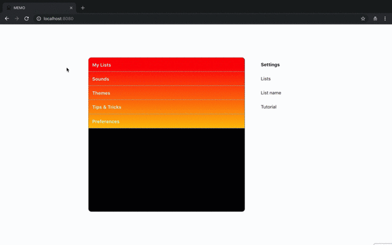

# Demo

# Service Name
TODO

# Description

# Dependency

# Setup

# Usage

# Licence
This software is released under the MIT License, see LICENSE.

# Authors
Kento Takeuchi & supported by [Greg Lafrance](https://github.com/glafrance).

# References
CLEAR
